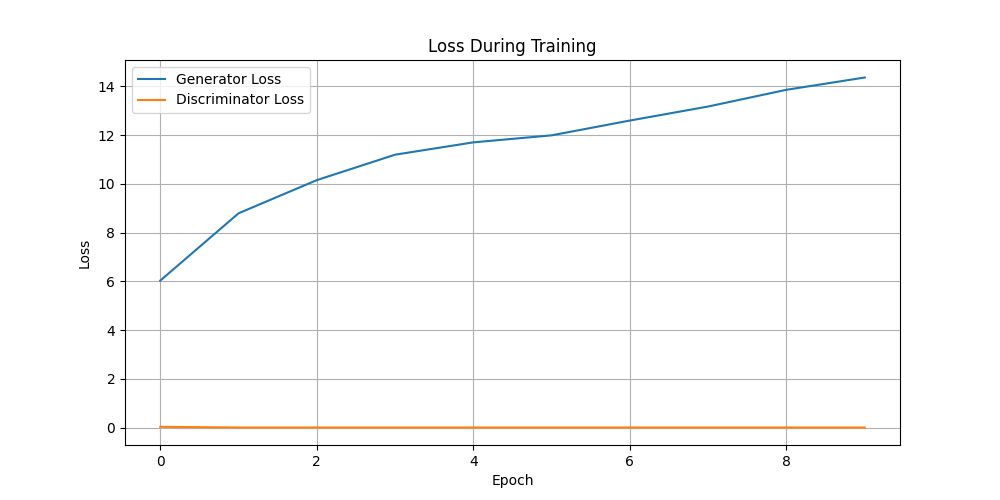
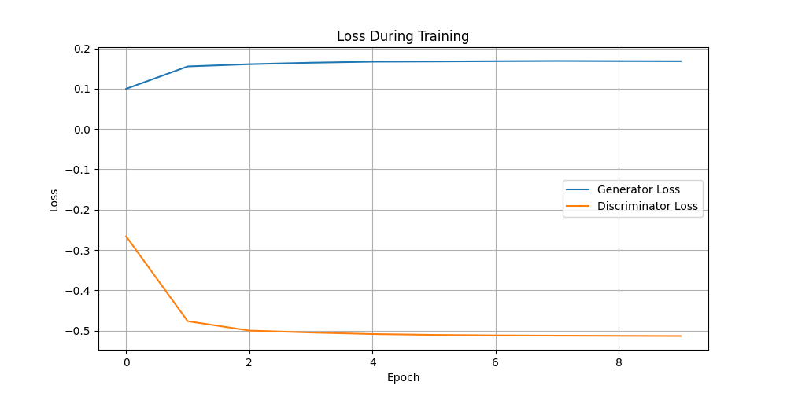
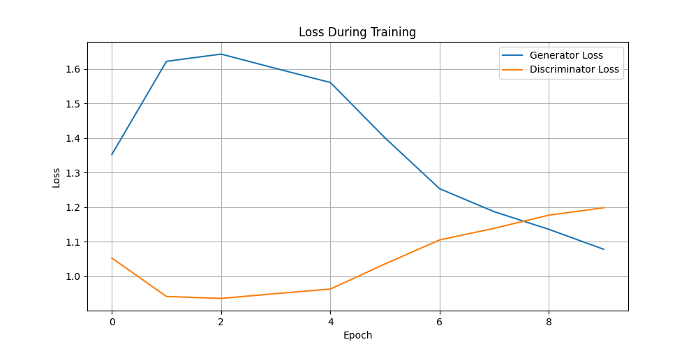

# Звіт про порівняння архітектур GAN

## **Мета**
Метою цього завдання було дослідити різні архітектури генеративно-змагальних мереж (GAN) та практикуватися з налаштуванням параметрів для досягнення кращих результатів генерації зображень. У проєкті були досліджені наступні архітектури:

- **DCGAN (Deep Convolutional GAN)**: Використання згорткових шарів для захоплення просторових властивостей зображень.
- **WGAN (Wasserstein GAN)**: Поліпшення стабільності навчання та якості генерації.
- **CGAN (Conditional GAN)**: Умовна генерація зображень на основі конкретних категорій (наприклад, цифри з MNIST).

---

## **Виконані кроки**

### **1. Вибір архітектур GAN**
Були реалізовані наступні архітектури GAN:

- **DCGAN:** Стандартна модель GAN із використанням згорткових шарів як для генератора, так і для дискримінатора.
- **WGAN:** Реалізована з використанням втрат Wasserstein для покращення збіжності та стабільності.
- **CGAN:** Розширення GAN для умовної генерації з урахуванням класів (наприклад, цифр з MNIST).

### **2. Підготовка набору даних**
Для всіх моделей був використаний набір даних MNIST. Цей набір складається з 28x28 зображень у градаціях сірого кольору рукописних цифр (0-9).  

### **3. Налаштування архітектури моделей**

#### **Генератор:**
- Проведені експерименти з кількістю шарів, розмірами фільтрів і активаціями (наприклад, ReLU, LeakyReLU).
- Налаштований вихідний шар для забезпечення правильних розмірів виходу (наприклад, 28x28 для MNIST).

#### **Дискримінатор:**
- Використані різні функції активації та шари нормалізації пакетів.
- Адаптовані шари для відповідності складності генератора.

#### **Функції втрат:**
- **Binary Cross-Entropy Loss:** Використано для DCGAN і CGAN.
- **Wasserstein Loss:** Використано для WGAN для уникнення проблем із затуханням градієнтів.

### **4. Методи налаштування**
- Розмір батчу: Варіювали розмір батчу для балансу між стабільністю та використанням пам'яті.
- Коефіцієнт навчання: Експериментували з різними значеннями для генератора і дискримінатора.
- Регуляризація: Додали шари Dropout до дискримінатора для запобігання перенавчанню.
- Оптимізатори: Використовували Adam для DCGAN і CGAN, RMSprop для WGAN.

### **5. Навчання та порівняння**
Кожна архітектура була навчена протягом 10 епох на одному і тому ж наборі даних для забезпечення узгодженості. Логи втрат зберігалися, а згенеровані зображення зберігалися періодично для візуальної оцінки.

### **6. Візуалізація результатів**
Графіки втрат і згенеровані зображення для кожної моделі були збережені й проаналізовані.

- **Графіки втрат:** 
  - [Графік втрат DCGAN](./saved_models/dcgan_loss.png)
  - [Графік втрат WGAN](./saved_models/wgan_loss.png)
  - [Графік втрат CGAN](./saved_models/cgan_loss.png)

- **Згенеровані зображення:**
  - [Зображення DCGAN](./generated_images/dcgan_image_0.png)
  - [Зображення WGAN](./generated_images/wgan_image_0.png)
  - [Зображення CGAN (Клас 1)](./generated_images/cgan_image_class1_0.png)

---

## **Аналіз згенерованих зображень**

### **1. DCGAN**
- **Переваги:** Згенеровані зображення відносно чіткі й нагадують цифри з набору даних MNIST.
- **Недоліки:** Зображення містять шум і незначні спотворення. Додаткові епохи навчання можуть покращити результати.
- **Висновок:** DCGAN досяг найкращого балансу між втратами генератора і дискримінатора, що призвело до найбільш реалістичних результатів.

### **2. WGAN**
- **Переваги:** Навчання було стабільним завдяки втратам Wasserstein.
- **Недоліки:** Згенеровані зображення шумні та не мають чітких характеристик цифр. Генератор не зміг створити зрозумілі виходи.
- **Висновок:** WGAN показав гірші результати порівняно з DCGAN, ймовірно, через недостатню кількість епох навчання або неефективне кліпування ваг.

### **3. CGAN**
- **Переваги:** Модель дозволяє умовну генерацію на основі міток класів.
- **Недоліки:** Згенеровані зображення надзвичайно шумні й не відповідають зазначеним умовам. Це вказує на проблеми з умовною подачею або недостатнє навчання.
- **Висновок:** CGAN зіткнувся з найбільшими труднощами, що свідчить про необхідність покращення архітектури та процесу навчання.

---

## **Аналіз графіків втрат**

### **1. Графік втрат DCGAN**


- Втрати генератора стабільно знижуються, що свідчить про покращення його роботи.
- Втрати дискримінатора показують незначні коливання, але дві мережі зберігають баланс.
- Рекомендація: Додаткове навчання могло б ще більше покращити результати.

### **2. Графік втрат WGAN**


- Втрати генератора постійно зростають, що вказує на нездатність генератора конкурувати з дискримінатором.
- Втрати дискримінатора залишаються майже незмінними біля нуля, що свідчить про його домінування над генератором.
- Рекомендація: Переглянути кліпування ваг і гіперпараметри для досягнення кращого балансу.

### **3. Графік втрат CGAN**


- Втрати генератора рано стабілізувалися, що свідчить про обмежене навчання.
- Втрати дискримінатора стабілізувалися на негативному рівні, можливо, через погану здатність розрізняти реальні й фейкові зображення.
- Рекомендація: Налаштувати умовну подачу та переконатися в коректності обробки вхідних міток.

---

## **Висновки та рекомендації**

### **Найкраща модель:** DCGAN
- **Причина:** Досягла найбільш реалістичних і різноманітних зображень із збалансованою динамікою навчання.

### **WGAN:**
- **Проблеми:** Генератор не зміг конкурувати з дискримінатором.
- **Рекомендації:** Експериментувати з меншим обмеженням ваг і збільшити кількість епох навчання.

### **CGAN:**
- **Проблеми:** Згенеровані зображення були шумними й не відповідали умовам.
- **Рекомендації:** Покращити умовну генерацію, додати більше епох навчання й перевірити обробку вхідних міток.

### **Майбутні покращення:**
1. Збільшити кількість епох навчання для всіх моделей.
2. Використовувати передові методи, такі як спектральна нормалізація, для стабілізації навчання.
3. Впровадити більш складні функції втрат (наприклад, hinge loss) для кращої збіжності.
4. Використовувати метрики, такі як Inception Score (IS) або Frechet Inception Distance (FID), для кількісної оцінки.

---

Цей звіт підсумовує продуктивність і проблеми різних архітектур GAN, протестованих на наборі даних MNIST. Для додаткових деталей або коду зверніться до репозиторію проєкту.

---

# Встановлення та запуск

## Створення та активація середовища

```
./setup_env.sh
source ./_env/bin/activate 
```

## 1. Встановлення необхідних бібліотек

```
pip install torch torchvision matplotlib
```

## Запуск тренування:
```
python ./train_dcgan.py
python ./train_wgan.py
python ./train_cgan.py
```